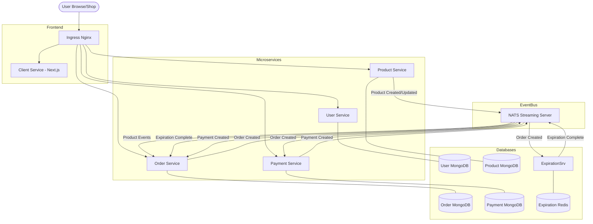

# Aurapan Project Overview

This document provides a high-level overview of the Aurapan microservices-based e-commerce project, including its architecture, project structure, and event-driven data flow.

## Project Structure

The project follows a microservices architecture where each service is self-contained with its own database and logic.

```text
microservices-ecommerce-main/
├── client/              # Next.js frontend application
├── user/                # Microservice for Auth (JWT, Cookies) & Profile
├── product/             # Microservice for Product catalog (CRUD)
├── order/               # Microservice for Order management & Reservations
├── payment/             # Microservice for Processing payments (Stripe/PayPal)
├── expiration/          # Microservice for Order expiration logic (Redis-based)
├── infra/               # Kubernetes manifests for deployment
│   ├── k8s/             # Standard K8s deployments & services
│   ├── k8s-dev/         # Development specific manifests
│   └── k8s-prod/        # Production specific manifests
├── docs/                # Project documentation and assets
├── skaffold.yaml        # Skaffold config for local development
└── setup.sh             # Initial setup script for Docker & K8s
```

## System Architecture

The following flowchart illustrates the system architecture and how different components interact with each other.



## Event-Driven Flow Details

1.  **Syncing Data**: When a product is created or updated in the `product` service, an event is published to NATS. The `order` service listens to these events to maintain a local "cached" copy of relevant product data (using the **Database-per-Service** pattern with eventual consistency).
2.  **Order Placement**: When a user creates an order, the `order` service publishes an `OrderCreated` event.
3.  **Timeout Logic**: The `expiration` service receives the `OrderCreated` event and starts a timer (using Redis). If the timer expires before payment, it publishes an `ExpirationComplete` event.
4.  **Payment Processing**: The `payment` service also receives the `OrderCreated` event. Once a user pays, it publishes a `PaymentCreated` event.
5.  **Finalizing Order**: The `order` service listens for both `ExpirationComplete` (to cancel the order) and `PaymentCreated` (to mark the order as complete).

## Technologies Used

- **Frontend**: Next.js, React-Bootstrap, Swiper
- **Backend**: Node.js, Express, TypeScript
- **Database**: MongoDB, Redis
- **Messaging**: NATS Streaming Server
- **Infrastructure**: Docker, Kubernetes, Skaffold, Ingress-Nginx
- **Payment**: Stripe API, PayPal API

## How to Run This Project (Local Development)

To run this project on your local machine using Docker Desktop, follow these steps:

### 1. Prerequisites
Ensure you have the following installed:
- [Docker Desktop](https://www.docker.com/products/docker-desktop) (Enable **Kubernetes** in settings).
- [Skaffold](https://skaffold.dev/docs/install/).
- [Node.js](https://nodejs.org/).
- [Ingress Nginx](https://kubernetes.github.io/ingress-nginx/deploy/#quick-start) (Run the command for Docker Desktop).

### 2. Configure Hosts File
You need to map a local domain to your machine. 
1. Open Notepad as **Administrator**.
2. Open `C:\Windows\System32\drivers\etc\hosts`.
3. Add the following line:
   ```text
   127.0.0.1 aurapan.com
   ```
   *(Note: Ensure this matches the host defined in your ingress configuration.)*

### 3. Setup Kubernetes Secrets
The services require several secrets to be present in the cluster. Run these commands in your terminal:

**JWT Secret:**
```bash
kubectl create secret generic jwt-secret --from-literal=JWT_KEY=asdf
```

**MongoDB Secrets:**
```bash
kubectl create secret generic mongo-secret \
  --from-literal=MONGO_URI_PRODUCT=mongodb://product-mongo-srv:27017/product \
  --from-literal=MONGO_URI_USER=mongodb://user-mongo-srv:27017/user \
  --from-literal=MONGO_URI_ORDER=mongodb://order-mongo-srv:27017/order \
  --from-literal=MONGO_URI_PAYMENT=mongodb://payment-mongo-srv:27017/payment
```

**Stripe & PayPal Secrets:**
```bash
kubectl create secret generic stripe-secret --from-literal=STRIPE_KEY=your_stripe_key
kubectl create secret generic paypal-secret --from-literal=PAYPAL_CLIENT_ID=your_paypal_id
```

### 4. Start the Project
Navigate to the root directory and run:
```bash
skaffold dev
```
Skaffold will build the images, create the pods, and set up hot-reloading. Once it's running, open your browser and go to `https://aurapan.com`.

*(Note: You might see a certificate warning because it's a self-signed local cert. You can bypass this by typing `thisisunsafe` in Chrome or clicking "Proceed anyway".)*
